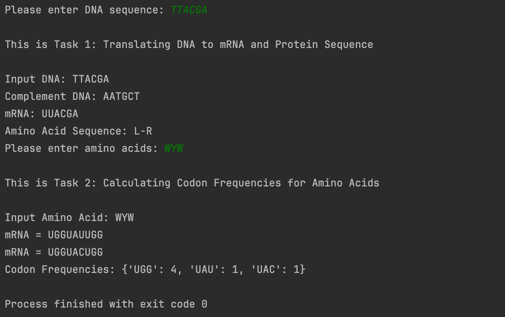

# Computational_Biology_Task
This is the W3 task for Computational Biology 

**Name: Ruixin Huang**

### Task Description:

1. Translate a DNA sequence -> mRNA (using “U” instead of ”T”) -> into an aminoacid sequence (protein)

   - PS:
     - The input should be multiple of 3 
     - (example:3 nucleotides, 6 nucleotides, 9 nucleotides, and so on)

2. Provides the frequency of each RNA codon encoding a given aminoacid, in a DNA sequence

   - PS:

     - Please provide all possibilities of the codon combination.

     - Input max. 3 Aminoacids.
   

### Sample Output:

